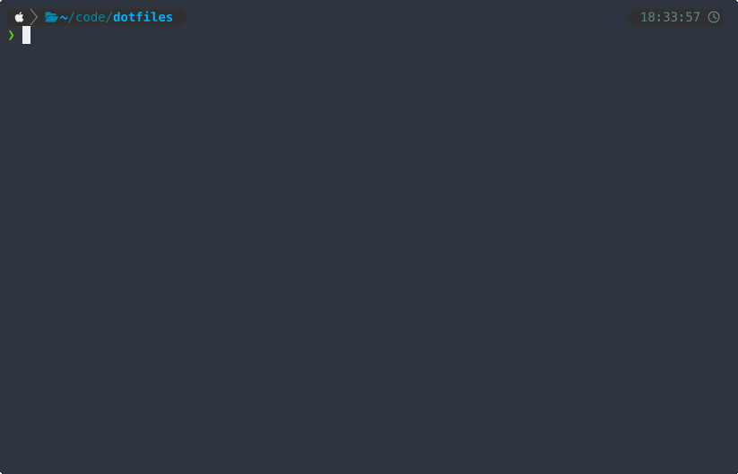

This repo is my daily driver. It's an opinionated, macOS-only terminal IDE built for keyboard-driven development with AI coding agents. Everything is managed through Homebrew, symlinked from a single git repo, and reproducible on a fresh machine with one command.

It's opinionated in the sense that it doesn't try to be portable. It assumes macOS, iTerm2, and a specific set of tools that I've settled on after years of tweaking. If that matches your setup, you can clone it and run `make install`. If not, treat it as a reference.

## Getting started

```bash
git clone --recursive https://github.com/alepeh/dotfiles.git
cd dotfiles
make install
```

The install script handles everything: installs Homebrew if missing, runs `brew bundle` to pull all dependencies, initializes git submodules, symlinks configs into place, and backs up anything it would overwrite with timestamped copies. Machine-specific settings like your git identity and signing key get extracted into `~/.gitconfig.local` before the global config is replaced.

## What you get out of the box

### Shell

The shell is **Zsh** with **Oh My Zsh** and **Powerlevel10k** — both pinned as git submodules so the setup is reproducible regardless of upstream changes. The prompt is a classic two-line powerline style with directory, git status, and contextual segments like Java version or execution time.

Plugins are deliberately minimal:

- **zsh-autosuggestions** — ghost text completions from history
- **zsh-syntax-highlighting** — real-time command coloring
- **zsh-completions** — extended completion definitions
- **fzf** — wires `Ctrl+R` for history, `Ctrl+T` for files, `Alt+C` for directories
- **zoxide** — frecency-based `cd` that learns your habits

All plugin repos are submodules. No plugin manager.

### Terminal utilities

Homebrew installs a set of modern CLI replacements that get aliased automatically:

| Classic | Replacement | What changes |
|---------|-------------|-------------|
| `ls` | **eza** | Icons, color, directory grouping |
| `cat` | **bat** | Syntax highlighting, line numbers |
| `grep` | **ripgrep** | Fast regex search across files |
| `find` | **fd** | Simpler syntax, respects `.gitignore` |
| `cd` | **zoxide** | Frecency-based jumping (`z project` instead of full paths) |

**fzf** ties it all together. File search uses `fd` as the backend, history search is `Ctrl+R`, and previews render through `bat` (for files) and `eza` (for directories). There are also two shell functions — `ff` for fuzzy-finding a file and opening it in Helix, and `fgr` for interactive grep with a bat preview.



### iTerm2

A dynamic profile ships with the repo and gets symlinked on install. It sets **Meslo LG Nerd Font** at 12pt, enables Powerline glyph rendering, unlimited scrollback, and a dark color scheme. Left Option is mapped to send `+Esc` so Alt keybindings work in Zellij and Helix.

### Git

Git is configured with **delta** for side-by-side diffs with syntax highlighting, **Helix** as the default editor, and `rerere` enabled so resolved merge conflicts are remembered and reapplied automatically. Common operations have short aliases: `st`, `co`, `br`, `lg` for a pretty graph log, and `amend` for a quick no-edit amend. Pull defaults to rebase, and first push auto-tracks the remote.

**lazygit** provides a full TUI for staging, committing, and branch management. It's available as `lg` from anywhere or in a dedicated tab in the Zellij layouts.

### File management

**Yazi** is a terminal file manager configured with no preview pane to maximize the file list. In the Zellij file browser tab, it's wired to open files directly in the adjacent Helix pane via a custom script — so you browse on the left and edit on the right.

## The IDE: Zellij + Helix

The core of the setup is **Zellij** as a terminal multiplexer and **Helix** as a modal editor. Both use the Catppuccin Mocha theme — and so does iTerm2, delta, and bat, so everything looks consistent.

### Helix

Helix is a post-vim modal editor with built-in LSP support, tree-sitter syntax highlighting, and multiple cursors. No plugin ecosystem needed — language intelligence works out of the box once you install the language servers.

The config enables relative line numbers, inline inlay hints, indent guides, soft wrap, and a ruler at column 100. Buffer navigation uses `H`/`L` to flip between open files, `Ctrl+hjkl` jumps between splits, and `jk` exits insert mode.

Language servers are configured for:

- **Python** — pyright + ruff (type checking, auto-import, formatting)
- **TypeScript/JavaScript** — typescript-language-server + prettier
- **Java** — jdtls (Eclipse JDT, pointing at Temurin 21)
- **JSON** — prettier

### Zellij layouts

Zellij replaces tmux with a friendlier keybinding model and built-in layout files. The leader key is `Ctrl+Space`, with `Alt+hjkl` as direct shortcuts for pane navigation.

There are six layouts, but two are the core daily drivers:

**`dev`** — the full IDE layout, launched with `dev` from any shell:


Three tabs: Claude Code paired with Helix on the main tab, a stacked shell below for quick commands. The git tab has lazygit for staging and branch work. The files tab pairs Yazi with Helix for browsing.

**`devmin`** — the minimal layout for vibe coding sessions, launched with `devmin`. Just Claude and a shell. No editor, no file browser — let the agent drive. This is the layout I reach for when I'm iterating on a well-defined task and want Claude to handle the editing directly.

There are also `review` layouts (editor-focused, with Claude and a shell below) and `cursor-*` variants that swap Claude Code for Cursor's agent CLI.

## Everything else

A few more things that round out the setup:

- **jenv** manages Java versions across Temurin 17, 21, and 24. Shell aliases (`j17`, `j21`, `j24`) switch the global version instantly.
- **MCP servers** connect Claude Code to external tools — Obsidian for notes, Todoist for tasks, GitHub for repos, and Google Workspace for email and calendar. Credentials live in `~/.env.mcp` (gitignored) and are injected via wrapper scripts.
- **Conventional commits** are enforced through Claude Code's global instructions (`~/.claude/CLAUDE.md`), which also set expectations for branching, testing, and PR format.
- **`make doctor`** runs a quick sanity check that all expected tools are installed and configs are in place.

## Reproducing it

```bash
git clone --recursive https://github.com/alepeh/dotfiles.git
cd dotfiles
make install
make doctor
```

That gets you from a fresh Mac to a working terminal IDE. Add your credentials to `~/.env.mcp`, run `make doctor-mcp` to verify, and you're set.
